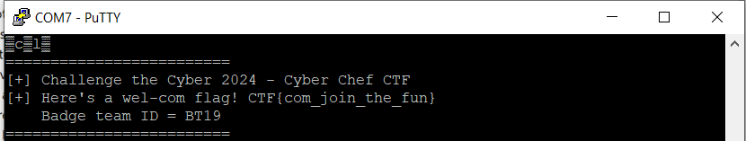

# Wel Com

#### Connecting to ESP8266:
* Open [PuTTY](https://www.chiark.greenend.org.uk/~sgtatham/putty/latest.html) and configure it as follows:
* Connection type: Serial
* Serial line: COM port associated with your ESP8266 (e.g., COM3)
* Speed (baud): 115200
* Flow control: None

Start the putty terminal and the flag will pop-up:

